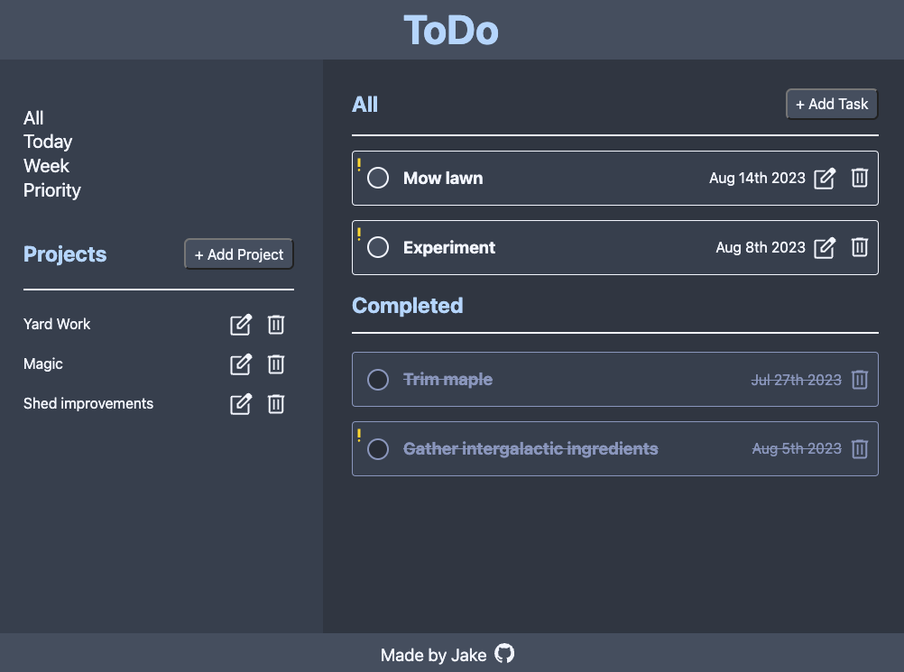

# To-Do

This was a step up in complexity and difficulty compared to my previous projects and, though difficult, it was fun to build! I chose to use factory functions to separate the task/project objects and used a project manager to coordinate the higher-level app logic. 

Goals:

- Follow the SOLID principles with emphasis on single-responsibility objects.
- Use the date-fns library to streamline date/time tasks.
- Utilize local storage to save state.
- Set up Webpack to manage increasing project complexity. 

[Check out the live version here!](https://jakenead.github.io/to-do/)

